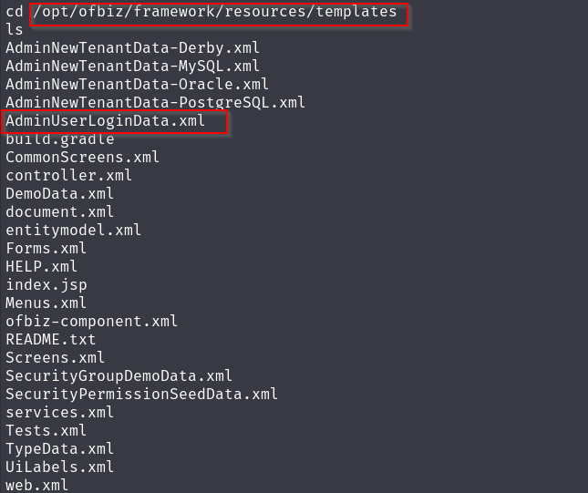

## INTRODUCCION
Walktrough de la Maquina Bizness, pasos que segui para lograr vulnerarla con éxito. 
 

## RECONOCIMIENTO
Se hace un escaneado de puertos y se investiga sobre la web con el puerto 80
nmap -p- -sCV --min-rate 5000 -n bizness.htb -Pn

## ANALISIS WEB
Indagaremos en la web por encima en busca de alguna versión o usuarios que nos puedan ser utiles

Al buscar posibles subdirectorios con el comando dirsearch obtenemos una dirección de un login "/control/login"
 
Nos llevará a un panel de login el cual si nos fijamos en el margen superior derecho visualizamos que esta usando Apache OFBiz:

## Authentication-Bypass
Al buscar vulnerabilidades contra Apache OFBiz visualizamos lo siguiente **CVE-2023-51467** y **CVE-2023-49070**
Por lo que vemos es vulnerable a una Authentication-Bypass (https://github.com/jakabakos/Apache-OFBiz-Authentication-Bypass)
utilizaremos esta dirección anterior de github para explotar la vulnerabilidad e intentar ganar acceso:
 
Nos pondremos a la escucha
 
Y lanzaremos el comando

Ganamos acceso!

## Escalada Privilegios
Encontramos en la siguiente ruta un xml donde pone "AdminUserLoginData"
 
Tras abrir con cat dicho archivo vemos un hash que parece estar cifrado en SHA

Pero el hash se encuentra en la siguiente ruta"/opt/ofbiz/runtime/data/derby/ofbiz/seg0"cogeremos el hash y lo descifraremos con el script.py 
 
(lo he generado con chatgpt para ver si era capaz de lograrlo). Le daremos permisos de ejecución al script

 
Parece que funciona correctamente!

