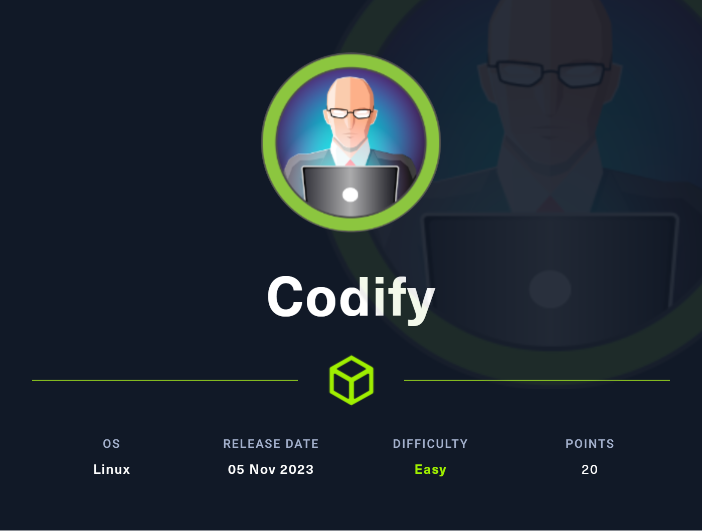
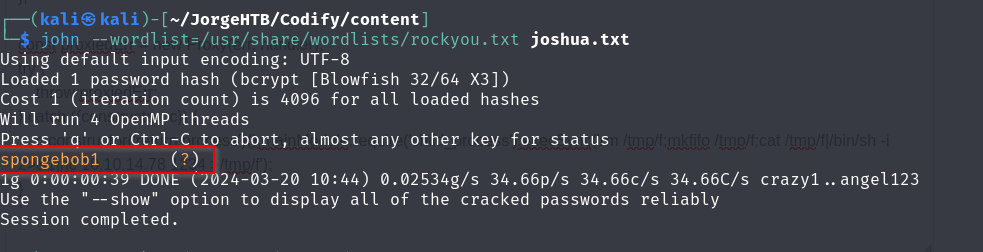

## INTRODUCCION
Walktrough de la Maquina Codify, pasos que segui para lograr vulnerarla con éxito. 
 

## RECONOCIMIENTO
Empezaremos escaneando los puertos de la máquina victima y visualizamos los siguientes puertos abiertos:

## ANALISIS WEB
Si observamos en el puerto 3000 hay una web que esta creada con Node.js

Pero antes buscaremos sobre esta web subdirectorios interesantes como logins o archivos ocultos, para ello enumeraremos con la herramienta Nikto 
 
 
Visualizamos una ruta de configuración que al parecer esta hecho en Wordpress pero sin éxito:
 
Vamos a utilizar otra herramienta ya conocida como dirsearch en busca de mas subdirectorios sobre el puerto 3000 y visualizamos un "About" y "Editor"

## Arbitrary JS Code
Al parecer hay una vulnerabilidad con esa librería vm2 que nos permite insertar código arbitrario con JS **POC** (https://www.bleepingcomputer.com/news/security/new-sandbox-escape-poc-exploit-available-for-vm2-library-patch-now/?source=post_page-----7c9b3c0dfef5--------------------------------) y **Github** (https://gist.github.com/leesh3288/381b230b04936dd4d74aaf90cc8bb244)
Si ponemos un simple /etc/passwd visualizamos que efectivamente se puede ver los usuarios de dicha maquina
 
Por lo que ahora probaremos hacer una revershell a nuestra maquina local
 
Al conseguir una consola como usuario svc del servidor web vemos que en la carpeta var/www/contact hay un archivo llamado tickets.db y visualizamos un usuario llamado Joshua y un hash

Meteremos el hash en un archivo llamado joshua.txt para descifrarlo con john y el diccionario de datos rockyou.txt

Probemos con un ssh con dicho usuario hacia la máquina objetiva:
ssh joshua@10.10.11.239 y la contraseña respectiva:
Ganamos acceso!

## Escalada Privilegios
Al hacer "sudo -" visualizamos que este usuario tiene permisos en la siguiente ruta:
 
Al leer dicho archivo al parecer debemos generar un script en Python que haga fuerza bruta para conseguir la contraseña del usuario del SQL 
[IMPORTANTE Explicación!] 
Esto significa que la entrada del usuario (USER_PASS) se trata como un patrón y, si incluye caracteres globales como * o ?, potencialmente puede coincidir con cadenas no deseadas.

Por ejemplo, si la contraseña real (DB_PASS) es contraseña123 y el usuario ingresa * como contraseña (USER_PASS), la coincidencia del patrón será exitosa porque * coincide con cualquier cadena, lo que resulta en un acceso no autorizado.

Esto significa que podemos aplicar fuerza bruta a cada carácter en DB_PASS

Script en python que hace esto mismo 
 
Ejecutamos el script 

Al hacer ya 'su root' y poner la contraseña descifrada con el script ejecutado anteriormente que funciona con fuerza bruta conseguimos acceso y bandera de root!

